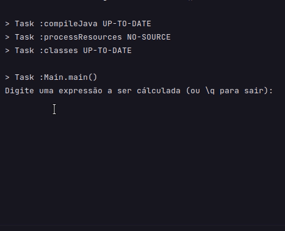

# Calculadora

Esse é um projeto de calculadora escrito em **Java** durante meus estudos sobre a linguagem. A calculadora utiliza-se de um conjunto com **CharStream**, **Lexer** e **Parser** para permitir que expressões ligeiramente complexas sejam inseridas, bem como funções e constantes sejam usadas.

## Funções Implementadas

Atualmente algumas funções já foram implementadas, sendo elas:

* `log(x)` - Logaritmo na base 10;
* `ln(x)` - Logaritmo na base e (logaritmo natural);

## Constantes Implementadas

Bem como as funções implementadas, temos suporte para algumas constantes:

* `pi` - retorna o valor de pi (~ 3.14159...).
* `e` - número de euler (~2.71828...).

